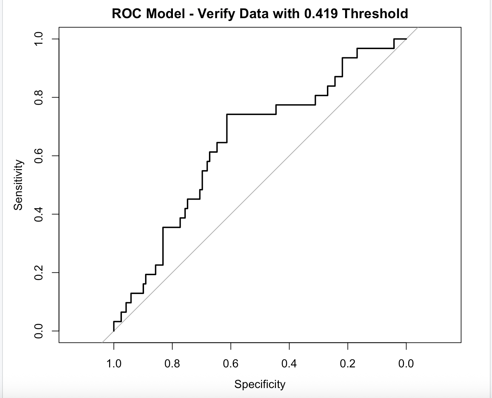
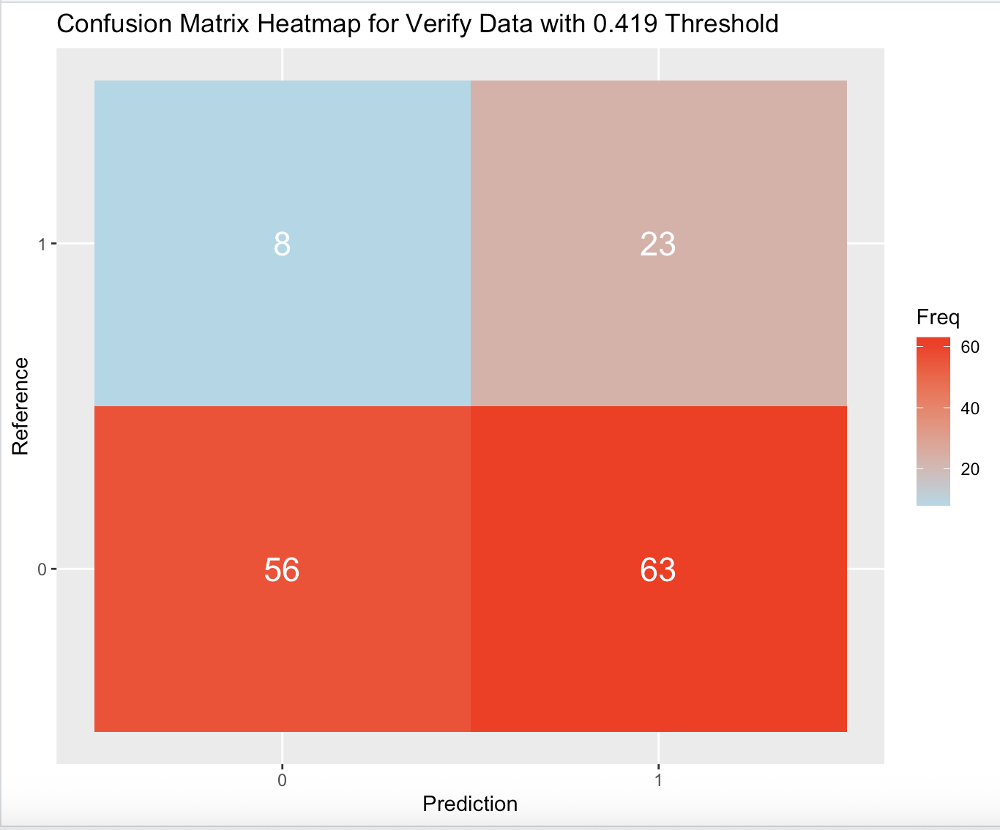
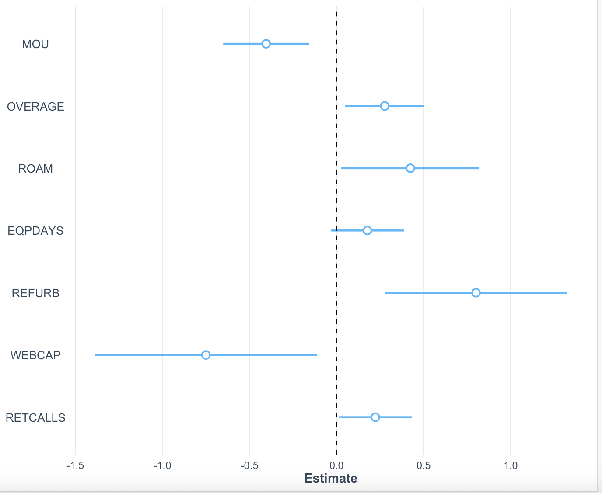

# Customer Churn Prediction (GE Case Study)

## Key Insight
Customer churn is driven more by usage behavior and device characteristics than by service quality issues—challenging the initial business assumption.

## Key Result
The model correctly identifies ~73% of churners, enabling proactive customer retention and reducing missed at-risk customers.

---

## Project Overview
This project develops a predictive analytics model to identify customers at risk of churn within a simulated General Electric (GE) healthcare IT subscription environment.  
The focus is not only on prediction, but on generating actionable insights and optimizing decision-making through threshold tuning.

---

## Model Snapshot
- **Recall:** ~73% of churners identified  
- **AUC:** ~0.64–0.66  
- **Impact:** 188 of 256 churners correctly flagged  
- **Approach:** Logistic Regression with stepwise feature selection  

---

## Business Questions
- What factors drive customer churn?  
- Can churn be predicted reliably?  
- Are service issues the primary cause of churn?  
- How can retention strategies be optimized using predictive modeling?  

---

## Dataset
- Source: SNHU Capstone Case Study  
- Observations: ~831 customer records  
- Target variable: Customer churn (binary classification)  
- Features: Usage behavior, device attributes, service interactions  

*Note: Dataset is not publicly available due to academic licensing restrictions.*

---

## Data Preparation
- Removed missing values and duplicates  
- Eliminated redundant variables  
- Reduced multicollinearity using correlation analysis  
- Split data into training, validation, and test sets  

---

## Exploratory Data Analysis
- Identified class imbalance (minority churn class)  
- Observed behavioral differences between churners and non-churners  
- Found strong influence of usage-related variables  
- Retained outliers due to business relevance  

---

## Modeling Approach
- Logistic Regression (chosen for interpretability)  
- Stepwise feature selection (AIC-based forward/backward)  
- Focus on optimizing recall and threshold selection  

---

## Key Visuals

These visuals summarize model performance and business interpretability.

### 1. Model Performance (ROC Curve)


The ROC curve shows the model performs better than random classification with an AUC of ~0.64–0.66.

---

### 2. Classification Results (Confusion Matrix)


The model identifies a high proportion of churners using a 0.419 threshold, prioritizing recall for retention use cases.

---

### 3. Key Drivers of Churn


Usage behavior (MOU) and device characteristics (REFURB, EQPDAYS) are the strongest predictors of churn.
---

## Key Drivers of Churn
- Mean Monthly Usage (MOU)  
- Refurbished Device Status (REFURB)  
- Roaming Usage (ROAM)  

These results show churn is driven by customer behavior and device condition, not service quality.

---

## Evaluation Strategy
Due to class imbalance, accuracy was not prioritized.

Model evaluated using:
- Recall (Sensitivity)  
- Precision  
- F1 Score  
- ROC-AUC  
- Matthews Correlation Coefficient (MCC)  

---

## Threshold Optimization
Instead of using a default 0.5 cutoff, thresholds were tuned:

- **0.419 threshold**
  - Higher recall (captures more churners)  
  - More false positives  

- **0.444 threshold (recommended)**
  - Balanced precision and recall  
  - Stronger overall performance  

Selected for deployment based on business tradeoff considerations.

---

## Business Impact
- ~73% of churners identified  
- Significant reduction in missed at-risk customers  
- Enables proactive retention strategies  

**Key takeaway:**  
Churn is primarily driven by usage patterns and device characteristics—not service-related assumptions.

---

## Business Recommendations

### Customer Retention
- Flag customers with declining usage early  
- Target high-risk users with proactive outreach  
- Focus on refurbished device segments  

### Product Strategy
- Reassess refurbished device offerings  
- Investigate roaming-related churn patterns  
- Offer adaptive plans for high-usage customers  

---

## Monitoring and Maintenance
- 30-day observation window  
- 60-day monitoring period  
- 90-day model refresh cycle  

Includes ongoing:
- Feature re-evaluation  
- Threshold adjustments  
- Monitoring for model drift  

---

## Tools and Technologies
- R  
- dplyr, ggplot2  
- caret  
- pROC, ROCR, PRROC  
- car (VIF analysis)  
- MASS (stepwise regression)  

---

## Repository Structure
data/        datasets (if permitted)  
scripts/     analysis scripts  
models/      trained models  
visuals/     charts and evaluation outputs  
reports/     RMarkdown report  
src/         helper functions  

---

## How to Run
```bash
git clone https://github.com/kathleenbutterfield-data/ge-customer-churn-capstone
cd ge-customer-churn-capstone
